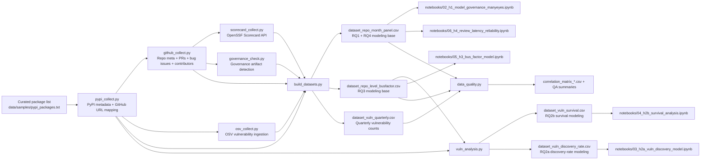

# OSS Transparency Pipeline: Architecture and Workflow

## 1) End-to-End Architecture

## 2) Workflow (Slide-Friendly)

1. **Sampling and Mapping**  
   `pypi_collect.py` reads curated PyPI packages and maps each package to a GitHub repository.

2. **Repository Process Collection**  
   `github_collect.py` ingests repository metadata, pull-request activity, bug issues, and contributor distributions.

3. **Security Signal Collection**  
   `osv_collect.py` captures vulnerability events; `scorecard_collect.py` captures security posture; `governance_check.py` captures policy/process artifacts.

4. **Feature Engineering and Dataset Construction**  
   `build_datasets.py` creates governance and transparency indices plus modeling-ready datasets:
   - `dataset_repo_month_panel` (RQ1, RQ4)
   - `dataset_repo_level_busfactor` (RQ3)
   - `dataset_vuln_quarterly` (supporting vulnerability trend view)

5. **Vulnerability Event Modeling Data**  
   `vuln_analysis.py` enriches OSV findings with fix-version and release-date logic to produce:
   - `dataset_vuln_discovery_rate` (RQ2a)
   - `dataset_vuln_survival` (RQ2b)

6. **Modeling and Validation**  
   Notebooks execute RQ-specific models; `data_quality.py` runs missingness, outlier, and collinearity checks.

## 3) Recommended Slide 6 Narration (30-45 sec)

"The pipeline starts with a curated PyPI package universe, then links packages to GitHub repositories. We collect process and collaboration metrics from GitHub, vulnerability events from OSV, governance maturity from artifact checks, and security posture from OpenSSF Scorecard. These are integrated into panel-level and repo-level analytical datasets. A specialized vulnerability pipeline then derives discovery-rate and time-to-fix datasets for survival analysis. Finally, hypothesis-specific notebooks and quality checks produce statistically validated evidence for governance, transparency, and maintainer-risk effects on software reliability."
